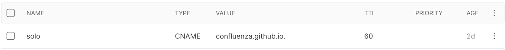
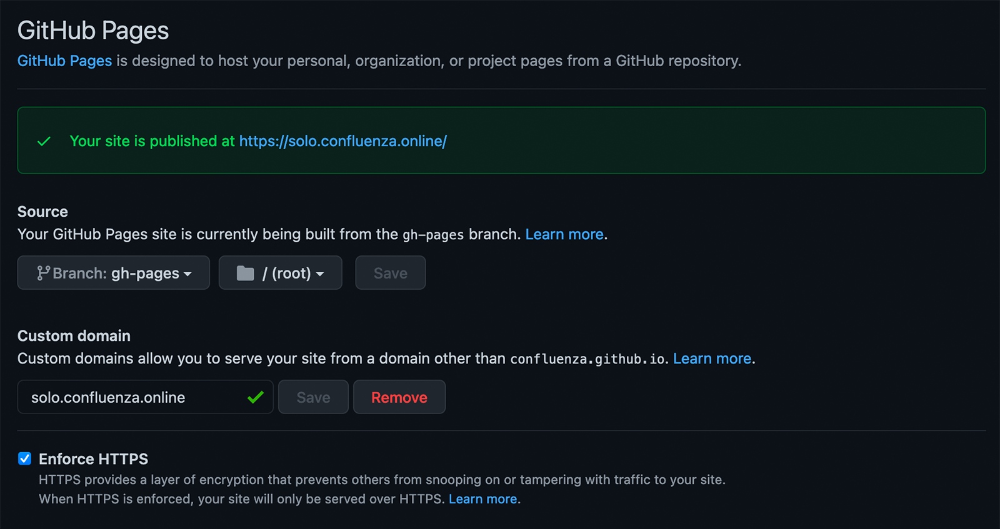

Confluenza is easy to deploy. As an example, in folder `.github/workflows/gh-pages.yaml` we show how to deploy Confluenza (solo) to
GitHub Pages. The important step is the `Build` action, which is equivalent to running:

```bash
» gatsby build
```

This will export the site to the `public` folder, which is then used by the `Deploy` action:

```bash
- name: Deploy 🚀
  uses: JamesIves/github-pages-deploy-action@4.1.4
  with:
    branch: gh-pages
    folder: public
    CLEAN: true
```

The `CLEAN` option is expected to delete generated files but leave the `.nojekyll` file alone. CLEAN is `true` by default.

In our demo, we use a custom subdomain `solo.confluenza.online`. 
Because the `solo-template` is a project repository in the `Confluenza` organization, we add an explicit CNAME record to the DNS configuration of the `confluenza.online` domain:

<a id="figure-1"></a> 
<div class="scrollable flex-wrap responsive">
<div class="bordered-content-800">
  
</div>
</div>
<div class="flex-wrap responsive">
<p class="figure-title"><b>Figure 1</b> CNAME DNS record for the <em>solo</em> subdomain</p>
</div>

The `VALUE` points to the default organization GitHub Page URL - `confleunza.github.io` - even though we do not deploy our organization home page with GitHub (we use Vercel for that). For this to work, in the repository settings in section `Pages` we have:

<a id="figure-2"></a> 
<div class="scrollable flex-wrap responsive">
<div class="bordered-content-800">
  
</div>
</div>
<div class="flex-wrap responsive">
<p class="figure-title"><b>Figure 2</b> GitHub Pages configuration in the solo-template repository settings</p>
</div>

Notice that when not using a custom subdomain, the GitHub Page for the `solo-template` repository would be published by GitHub Pages at `confluenza.github.io/solo-template`. In such a case, we need to add `pathPrefix` attribute in `gatsby-config.js` file:

```javascript
module.exports = {
  siteMetadata: {
    title: 'Confluenza Solo',
    editBaseUrl: 'https://github.com/confluenza/solo-template/blob/master'
  },
  pathPrefix: '/solo-template',
  plugins: [
    {
      resolve: '@confluenza/gatsby-theme-confluenza',
      options: {
        mdx: true
      }
    },
    'gatsby-plugin-emotion',
    'gatsby-plugin-catch-links',
    'gatsby-plugin-root-import'
  ]
}
```

and then, in the `gh-pages.yaml` file, we would need to use the `build:prefix-paths` script to build the site, which is defined in `package.json` as follows:

```json
"build:prefix-paths": "gatsby build --prefix-paths"
```

To learn more about challenges when using a custom domain with a project repository, we recommend [How to set up MULTIPLE GitHub Pages websites with custom domains](https://deanattali.com/blog/multiple-github-pages-domains/). See also what GitHub Pages documentation says about [Managing a custom domain for your GitHub Pages site](https://docs.github.com/en/pages/configuring-a-custom-domain-for-your-github-pages-site/managing-a-custom-domain-for-your-github-pages-site#configuring-a-subdomain).

<style scoped>
.scrollable {
  width: 100%;
  overflow-x: auto;
}
.flex-wrap {
  display:flex;
  flex-flow:column;
  justify-content:center;
  align-items: center;
}
@media (max-width: 650px) {
  .responsive {
    align-items: flex-start;
  }  
}
.figure-title {
  font-size: 0.8em
}
.bordered-content-800 {
  width: 600px;
  border: 1px solid black;
}
.bordered-content-600 {
  width: 600px;
  border: 1px solid black;
}
.bordered-content-300 {
  width: 300px;
  border: 1px solid black;
}
</style>
